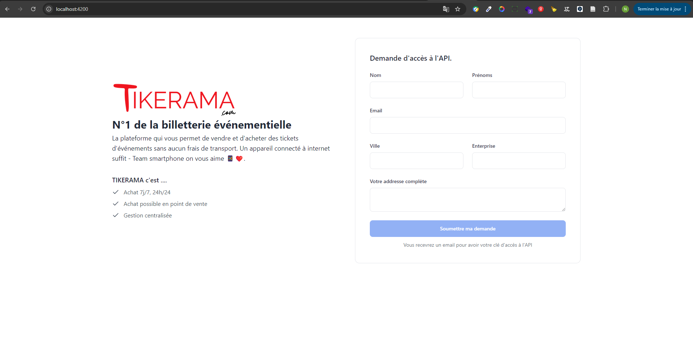

<p align="center"><a href="https://www.tikerama.com" target="_blank"></a></p>

# Documentation de l'API de billetterie événementielle

## Introduction

Ce projet implémente un système permettant aux utilisateurs de faire une demande d'accès à une API via une interface web
développée avec Angular. Les demandes sont traitées et stockées côté serveur avec Laravel.



## Configuration et Installation

### Prérequis

- Node.js et npm
- Angular CLI

### Étapes d'installation

```

**Frontend (Angular)**

   ```bash
   # Naviguer vers le dossier frontend
   cd dossier_du_projet

   # Installer les dépendances
   npm install
   
   # Lancer le serveur laravel sur votre address IP
   
   #remplacer l'url   private apiUrl = 'http://192.168.46.187:8000/api/v1/tokens/create' par votre adresse IP dans le service ApiAccessRequestService
 
   # Lancer le serveur de développement
   ng serve
   ```

## Utilisation

1. Accédez à l'application Angular via `http://localhost:4200`
2. Remplissez le formulaire de demande d'accès à l'API
3. Soumettez le formulaire
4. Un message de succès s'affichera si la demande est correctement enregistrée

## API Endpoints

- POST `/api/v1/tokens/create`
  - Corps de la requête : `{ name, surname, entreprise, email, city, address }`
  - Réponse de succès : `{ message: 'Une clé d'accès à l'API vous a été envoyée par email.' }`

